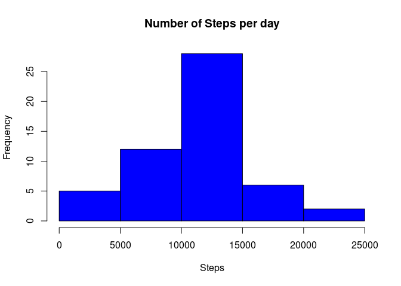
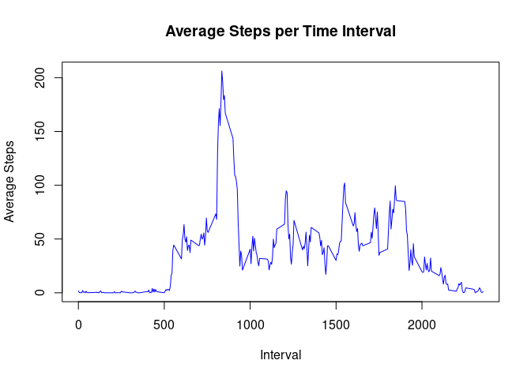
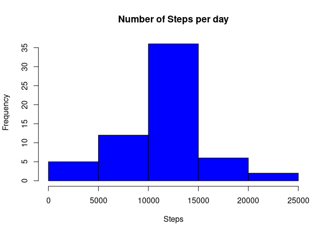
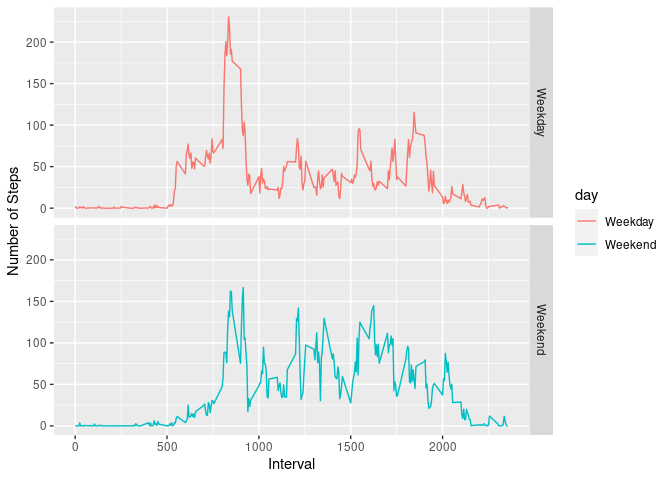

## Loading and preprocessing the data


Unzip the data and read it. The data is "duplicated" just as a backup.


```r
data_raw <- read.csv(unz("activity.zip", "activity.csv"))
data <- data_raw
```

Transform the *date* column from char to date.


```r
data$date <- as.Date(data$date, "%Y-%m-%d")
```

## What is mean total number of steps taken per day?

Sum all steps taken per day. To do so, first load the *dplyr* package.


```r
library(dplyr)
```

```
## 
## Attaching package: 'dplyr'
```

```
## The following objects are masked from 'package:stats':
## 
##     filter, lag
```

```
## The following objects are masked from 'package:base':
## 
##     intersect, setdiff, setequal, union
```

Group the data by *date* and sum the steps. Dplyr will automatically sum 
all steps taken in a same day.


```r
stp_day <- data %>% 
  group_by(date) %>% 
  summarise(steps = sum(steps))
```

```
## `summarise()` ungrouping output (override with `.groups` argument)
```

With the new data frame is possible to plot the histogram.


```r
hist(stp_day$steps, 
     col = "blue",
     main = "Number of Steps per day",
     xlab = "Steps")
```

<!-- -->

Calculating the step median and mean.


```r
summary(stp_day$steps)
```

```
##    Min. 1st Qu.  Median    Mean 3rd Qu.    Max.    NA's 
##      41    8841   10765   10766   13294   21194       8
```
As the summary shows, the median is 10765 and the
mean is 1.0766189\times 10^{4}


## What is the average daily activity pattern?

Group by interval (across all days) and take the average


```r
stp_int <- data %>% 
  group_by(interval) %>% 
  summarise(steps = mean(steps, na.rm = T))
```

```
## `summarise()` ungrouping output (override with `.groups` argument)
```
Plot the time series.


```r
plot(stp_int$interval, stp_int$steps, 
     type = "l", col = "blue",
     main = "Average Steps per Time Interval",
     xlab = "Interval",
     ylab = "Average Steps")
```

<!-- -->

Get maximum number of steps.


```r
smi <- which.max(stp_int$steps)
max_interval <- stp_int[smi,1]
max_steps <- stp_int[smi,2]
```


The maximum average number of steps is 206, which occurs at 
the interval 835


## Imputing missing values

With the command *summary* is possible to evaluate how many missing values there
are in each row.


```r
nna <- summary(data)
nna
```

```
##      steps             date               interval     
##  Min.   :  0.00   Min.   :2012-10-01   Min.   :   0.0  
##  1st Qu.:  0.00   1st Qu.:2012-10-16   1st Qu.: 588.8  
##  Median :  0.00   Median :2012-10-31   Median :1177.5  
##  Mean   : 37.38   Mean   :2012-10-31   Mean   :1177.5  
##  3rd Qu.: 12.00   3rd Qu.:2012-11-15   3rd Qu.:1766.2  
##  Max.   :806.00   Max.   :2012-11-30   Max.   :2355.0  
##  NA's   :2304
```

Only the *steps* column has missing values (NA's   :2304  ). So, the total number
of rows with missing values is the same as the total number of missing values in
this column.

To address this issue, all missing values will be filled with the average number
of steps by day for the corresponding interval.


```r
data_new <- data

stp_na <- which(!complete.cases(data$steps))

for(i in stp_na)
{
     data_new[i, 1] <- stp_int[data_new[i,3] == stp_int$interval ,2]
     
}
```

Sum all the steps for each day.


```r
stp_day_new <- data_new %>% 
  group_by(date) %>% 
  summarise(steps = sum(steps))
```

```
## `summarise()` ungrouping output (override with `.groups` argument)
```

```r
summary(stp_day_new$steps)
```

```
##    Min. 1st Qu.  Median    Mean 3rd Qu.    Max. 
##      41    9819   10766   10766   12811   21194
```

Filling the NAs with the interval mean steps does not shift significantly the 
mean or median. This can be also noticed with a histogram.


```r
hist(stp_day_new$steps, 
     col = "blue",
     main = "Number of Steps per day",
     xlab = "Steps")
```

<!-- -->


## Are there differences in activity patterns between weekdays and weekends?


Create new factors for weekday and weekend.


```r
wd <- !(weekdays(data_new$date) %in% c("Saturday","Sunday"))
we <- weekdays(data_new$date) %in% c("Saturday","Sunday")

data_new$day[wd] <- "Weekday"
data_new$day[we] <- "Weekend"

data_new$day <- as.factor(data_new$day)
```
Group data by day and interval and calculate the step mean.


```r
stp_int_new <- data_new %>% 
     group_by(day, interval) %>% 
     summarise(steps = mean(steps, na.rm = T), day = day)
```

```
## `summarise()` regrouping output by 'day', 'interval' (override with `.groups` argument)
```

Load ggplot2 library


```r
library(ggplot2)
```


Plot number of steps vs time interval on two different panels, on for weekend
and other for weekdays.


```r
g <- ggplot(stp_int_new, aes(interval, steps))

g + geom_line(aes(color = day)) + 
     facet_grid(day~.) +
     labs(y = "Number of Steps", x  = "Interval")
```

<!-- -->


There is a difference in activities. In the weekend the pattern is "shifted"
to the right, the number of steps in higher intervals has increased, probably
meaning that more activities are been done.


